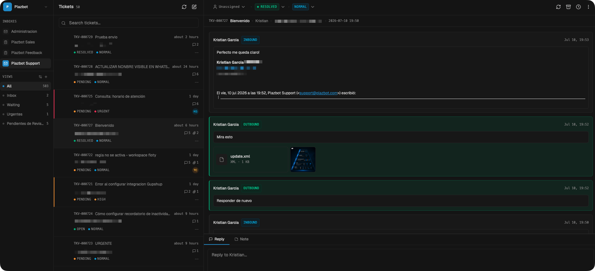
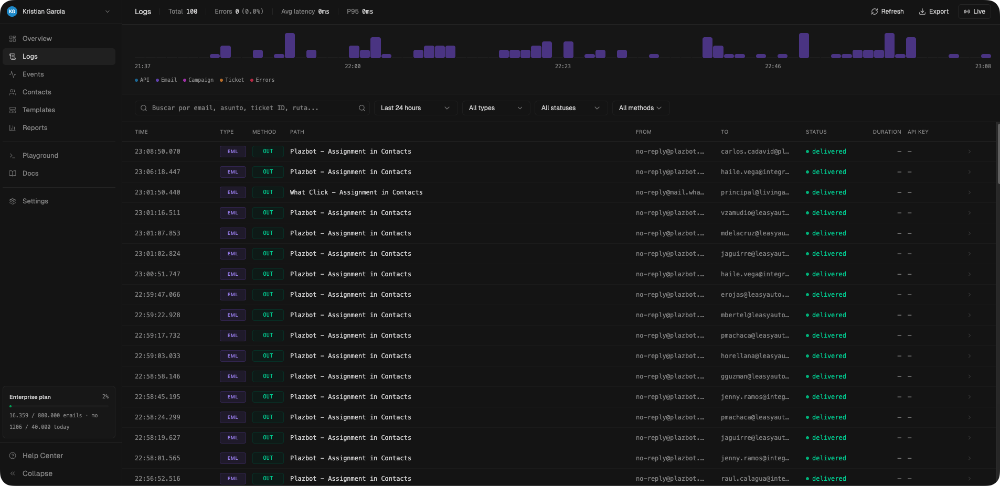

<div align="center">

# TickOS Client Desk

**The open-source support inbox for developers**

A modern, mail-style ticket inbox for support agents. Built with Next.js 15, powered entirely by the [TickOS](https://tickos.dev) REST API.

[](LICENSE)
[](https://nextjs.org)
[](https://typescriptlang.org)
[](https://tailwindcss.com)

[Demo](https://tickos.dev) &bull; [Documentation](https://tickos.dev/docs) &bull; [Report Bug](https://github.com/tickosdev/tickos-client-desk/issues)

**TickOS Client**



<br />

**TickOS Core**



---

</div>

## Deploy

Deploy your own instance in one click:

[](https://vercel.com/new/clone?repository-url=https://github.com/tickosdev/tickos-client-desk&env=TICKOS_SESSION_SECRET&envDescription=Random%20string%20to%20sign%20session%20cookies&project-name=tickos-client&repository-name=tickos-client)
[](https://railway.com/template/tickos-client?referralCode=tickos)

## Features

- **Mail-style inbox** — Three-panel layout (sidebar, ticket list, ticket detail)
- **Split inbox views** — Configurable filtered views: All, Inbox, Waiting, Unread, Archived, custom
- **Bulk actions** — Select multiple tickets to mark read/unread, archive, delete, snooze
- **Compose email** — Create new outbound tickets from the client
- **Snooze** — Quick picks (1h, tomorrow, next week) or custom date
- **Reply and notes** — Reply to customers or leave internal notes
- **Status and priority** — Inline dropdowns for quick management
- **Keyboard shortcuts** — J/K navigation, keyboard-driven workflow
- **Dark/light mode** — Full theme support with system detection
- **Multi-workspace** — Switch between multiple TickOS workspaces
- **Tag management** — Add and remove tags from tickets
- **Customer panel** — View customer details and related tickets
- **API-first** — 100% driven by TickOS REST API, zero local database
- **Secure proxy** — API keys never reach the browser

## Quick Start

### Prerequisites

- [Node.js](https://nodejs.org) 18.0 or higher
- A [TickOS](https://tickos.dev) account with an API key

### 1. Clone and install

```bash
git clone https://github.com/tickosdev/tickos-client-desk.git
cd tickos-client-desk
npm install
```

### 2. Configure environment

```bash
cp .env.example .env.local
```

Edit `.env.local`:

```env
# Required: random string to sign session cookies
TICKOS_SESSION_SECRET=your-random-secret-here

# Optional: pre-seed workspaces (otherwise configure via UI)
# TICKOS_WORKSPACES=[{"name":"My Workspace","url":"https://api.tickos.dev","key":"sk_xxx"}]
```

### 3. Start development server

```bash
npm run dev
```

Open [http://localhost:3001](http://localhost:3001). If no workspaces are configured, the setup wizard will guide you.

## How It Works

The client is a **thin Next.js frontend** that communicates with the TickOS backend exclusively through its REST API. A server-side proxy injects API keys so credentials never reach the browser.

```
Browser  -->  /api/tickets  -->  Next.js Proxy  -->  api.tickos.dev/api/v1/tickets
                                (injects API key)
```

### Authentication Flow

1. First visit redirects to the **setup wizard** (if no workspaces configured)
2. Enter your TickOS API URL + API key
3. Login with your email and password
4. A JWT session cookie (`tickos-session`) is issued
5. All subsequent API calls go through the secure proxy

### Multi-Workspace

You can configure multiple TickOS workspaces, each with its own API key. Use the workspace switcher in the sidebar to move between them. Workspace configs are stored in `data/workspaces.json` (git-ignored).

## Tech Stack

| Layer | Technology |
|-------|-----------|
| Framework | [Next.js 15](https://nextjs.org) (App Router) |
| Language | [TypeScript 5.7](https://typescriptlang.org) |
| Styling | [Tailwind CSS 3.4](https://tailwindcss.com) |
| UI Components | [Shadcn UI](https://ui.shadcn.com) + [Radix UI](https://radix-ui.com) |
| State | [Jotai](https://jotai.org) |
| Icons | [Lucide React](https://lucide.dev) |
| Auth | [jose](https://github.com/panva/jose) (JWT) |
| Forms | [React Hook Form](https://react-hook-form.com) + [Zod](https://zod.dev) |
| Fonts | [Geist](https://vercel.com/font) Sans + Mono |

## Project Structure

```
src/
├── app/
│   ├── api/
│   │   ├── [...path]/       # Proxy to TickOS API v1
│   │   └── auth/            # Login, logout, session
│   ├── login/               # Login & setup wizard
│   └── page.tsx             # Main inbox (protected)
├── components/
│   ├── mail/                # Inbox: ticket list, display, compose, bulk actions, etc.
│   └── ui/                  # Shadcn UI primitives (24+ components)
├── hooks/                   # Custom hooks (split inbox, etc.)
└── lib/
    ├── api-client.ts        # Full TickOS API client
    ├── auth.ts              # JWT session management
    ├── store.ts             # Jotai atoms (global state)
    └── workspaces.ts        # Workspace config persistence
```

## Scripts

| Command | Description |
|---------|-------------|
| `npm run dev` | Development server (port 3001) |
| `npm run build` | Production build |
| `npm start` | Production server |
| `npm run lint` | ESLint |
| `npm run type-check` | TypeScript type checking |

## API Coverage

The client implements a complete TypeScript client for the TickOS REST API v1:

| Resource | Operations |
|----------|-----------|
| Accounts | List workspaces |
| Inboxes | List, configuration |
| Tickets | CRUD, status, priority, assign, archive, snooze, delete |
| Messages | List, reply, internal notes |
| Tags | List, add/remove from tickets |
| Customers | Get details, related tickets |
| Users | List agents for assignment |
| Stats | Ticket statistics |
| Bulk | Mark read/unread, archive/unarchive, delete |
| Compose | Create outbound tickets |

## Environment Variables

| Variable | Required | Description |
|----------|----------|-------------|
| `TICKOS_SESSION_SECRET` | Yes | Random string to sign JWT session cookies |
| `TICKOS_WORKSPACES` | No | JSON array to pre-seed workspaces (otherwise configure via UI) |

## Configuring the TickOS API URL

The client is **not tied to a fixed API URL at build time**. Each workspace stores its own API URL, and every request (login + API proxy) uses the URL of the active workspace.

There are two ways to set it:

1. **Via the UI (recommended)** — On first run, the setup wizard asks for the API URL and an API key. You can also add/edit workspaces later from **Settings → Workspaces**. The config is persisted server-side in `data/workspaces.json` (git-ignored, never sent to the browser).

2. **Via environment variable** — Pre-seed one or more workspaces with `TICKOS_WORKSPACES`:

   ```env
   TICKOS_WORKSPACES=[{"name":"My Workspace","url":"https://api.tickos.dev","key":"sk_xxx"}]
   ```

### Which URL should I use?

| Environment | URL |
|-------------|-----|
| Production (TickOS cloud) | `https://api.tickos.dev` |
| Self-hosted tickos-core | `https://api.your-domain.com` (your own API domain) |
| Local development (tickos-core running locally) | `http://localhost:3000` |

### Changing the default suggested URL

`https://api.tickos.dev` appears only as the **pre-filled default** in the UI. If you fork this project and want a different default, change it in these two files:

| File | What |
|------|------|
| `src/app/login/page.tsx` | Initial value of the API URL field in the setup wizard |
| `src/components/mail/settings-dialog.tsx` | Initial value of the API URL field when adding a workspace from Settings |

No other code references the API host — the proxy (`src/app/api/[...path]/route.ts`) and the login route always read the URL from the active workspace config.

## Self-Hosting

### Docker

```dockerfile
FROM node:18-alpine AS builder
WORKDIR /app
COPY package*.json ./
RUN npm ci
COPY . .
RUN npm run build

FROM node:18-alpine AS runner
WORKDIR /app
COPY --from=builder /app/.next ./.next
COPY --from=builder /app/node_modules ./node_modules
COPY --from=builder /app/package.json ./
COPY --from=builder /app/public ./public

ENV NODE_ENV=production
EXPOSE 3000
CMD ["npm", "start"]
```

### Vercel

Click the **Deploy with Vercel** button above or:

```bash
npm i -g vercel
vercel
```

### Railway

Click the **Deploy on Railway** button above or connect your GitHub repo directly from the [Railway dashboard](https://railway.com).

## Contributing

Contributions are welcome. Please follow these steps:

1. Fork the repository
2. Create a feature branch (`git checkout -b feature/my-feature`)
3. Commit your changes (`git commit -m 'Add my feature'`)
4. Push to the branch (`git push origin feature/my-feature`)
5. Open a Pull Request

Please open an issue first to discuss larger changes.

## License

MIT - see [LICENSE](LICENSE) for details.

---

<div align="center">

Built by [TickOS](https://tickos.dev)

</div>
